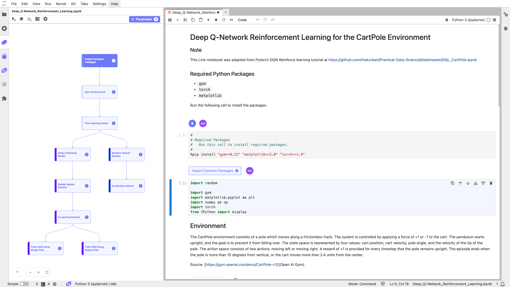

# [Link™](https://link.makinarocks.ai/)

[](https://mybinder.org/v2/gh/makinarocks/mrx-link-examples/main?labpath=Link_Intro.ipynb)

A JupyterLab extension for creating a pipeline with notebook cells



## Usage Environment

| Supported Platform | Linux (AMD64, ARM64) / macOS (Intel, Apple Silicon) / Windows |
| ------------------ | ------------------------------------------------------------- |
| Python Version     | 3.8, 3.9, 3.10                                                |
| Requirements       | Git                                                           |

## Install

We recommend installing our program in a new virtual environment.

Step 1. Install Link with the following command.

```
python3 -m pip install --upgrade mrx-link
```

Step 2. After installation, run JupyterLab.

```
python3 -m jupyterlab
```

## Features

**Pipeline Creation**

Create a pipeline with notebook cells to improve code readability and reproducibility.

**Caching Management**

Store execution results for respective cells to minimize redundant cell executions.

**Remote Resources**

Optimize the use of server resources by using separate resources for different pipeline components.

**Hyper-Parameter Optimizer**

Link provides a hyper-parameter feature, which works to find optimal hyper-parameters in an automated manner.

**Version Control**

Link provides a version control feature, where you can easily view changes to your pipeline and merge conflicts.

**Link SDK**

Link provides an SDK, where you can easily run the Link notebook file with the command line interface, and create, run, export pipelines with Python code.

## Examples with Link Pipelines

- [Deep Q-Network Reinforcement Learning for the CartPole Environment](https://mybinder.org/v2/gh/makinarocks/mrx-link-examples/main?labpath=sample-notebooks/Deep_Q-Network_Reinforcement_Learning.ipynb)

- [Denoising Autoencoder with PyTorch](https://mybinder.org/v2/gh/makinarocks/mrx-link-examples/main?labpath=sample-notebooks/Denoising_Autoencoder.ipynb)

- [Iris Classification](https://mybinder.org/v2/gh/makinarocks/mrx-link-examples/main?labpath=sample-notebooks/Iris_EDA_and_Modeling.ipynb)

- [MNIST Image Classification with PyTorch](https://mybinder.org/v2/gh/makinarocks/mrx-link-examples/main?labpath=sample-notebooks/MNIST_Classification.ipynb)

- [MNIST Image Generation with VAE](https://mybinder.org/v2/gh/makinarocks/mrx-link-examples/main?labpath=sample-notebooks/MNIST_Generation_with_VAE.ipynb)

- [Spiral-Distributed Data Classification](https://mybinder.org/v2/gh/makinarocks/mrx-link-examples/main?labpath=sample-notebooks/Spiral_Classification.ipynb)

- [Sequential Data Classification](https://mybinder.org/v2/gh/makinarocks/mrx-link-examples/main?labpath=sample-notebooks/Text_Classification_with_RNN.ipynb)

- [Titanic Data EDA and Modeling](https://mybinder.org/v2/gh/makinarocks/mrx-link-examples/main?labpath=sample-notebooks/Titanic_EDA_and_Modeling.ipynb)

- [XGBoost Example](https://mybinder.org/v2/gh/makinarocks/mrx-link-examples/main?labpath=sample-notebooks/XGBoost.ipynb)
